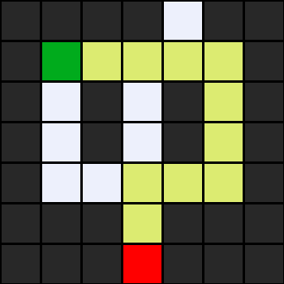
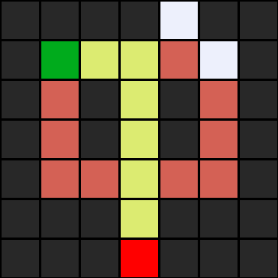

# CS50's Introduction to Artificial Intelligence - Search

## Introduction

This repository contains the implementation of search algorithms discussed in CS50's Introduction to Artificial Intelligence course. The focus is on various search techniques used to solve problems where an agent needs to find a path from an initial state to a goal state.

## Artificial Intelligence

Artificial Intelligence involves creating systems that can perform tasks that typically require human intelligence. In the context of search problems, AI agents must make decisions about which actions to take to reach their objectives efficiently.

## Search

Search problems involve:
- **Initial State**: The starting point of the problem
- **Actions**: The possible moves available from any given state
- **Transition Model**: How actions change the current state
- **Goal Test**: Determines if the current state is the goal
- **Path Cost**: The cost associated with a particular path

## Solving Search Problems

Search algorithms systematically explore the state space to find a solution. They maintain a **frontier** (set of states to explore) and keep track of **explored** states to avoid cycles.

### Key Components:
- **Node**: Contains state, parent, action, and path cost
- **Frontier**: Data structure holding nodes to be explored
- **Explored Set**: Previously visited states

## Depth First Search (DFS)

DFS explores as far as possible along each branch before backtracking. It uses a **stack** (LIFO) for the frontier.

**Characteristics:**
- Not optimal (doesn't guarantee shortest path)
- Complete in finite state spaces
- Space complexity: O(bm) where b is branching factor, m is maximum depth
- Time complexity: O(b^m)

## Breadth First Search (BFS)

BFS explores all nodes at the current depth before moving to nodes at the next depth. It uses a **queue** (FIFO) for the frontier.

**Characteristics:**
- Optimal for unweighted graphs
- Complete if branching factor is finite
- Space complexity: O(b^d) where d is depth of solution
- Time complexity: O(b^d)

## Greedy Best-First Search

This algorithm selects the node that appears to be closest to the goal based on a heuristic function h(n).

**Characteristics:**
- Uses heuristic to guide search
- Not optimal
- More efficient than uninformed search
- Can get stuck in local optima

## A* Search

A* combines the benefits of Dijkstra's algorithm and Greedy Best-First Search. It uses f(n) = g(n) + h(n), where:
- g(n): Cost from start to current node
- h(n): Heuristic estimate from current node to goal

**Characteristics:**
- Optimal if heuristic is admissible (never overestimates)
- Complete
- Optimally efficient
- Space complexity can be exponential

## Adversarial Search

In adversarial search, multiple agents have conflicting goals. This is common in games where one player's gain is another's loss (zero-sum games).

### Game Components:
- **Players**: The agents in the game
- **Initial State**: Starting position
- **Actions**: Legal moves available
- **Result**: Outcome of an action
- **Terminal Test**: Determines if game is over
- **Utility Function**: Assigns numerical value to terminal states

## Minimax

Minimax is a decision-making algorithm for turn-based games. It assumes both players play optimally:
- **Maximizing player**: Tries to maximize the score
- **Minimizing player**: Tries to minimize the score

The algorithm recursively evaluates all possible moves and chooses the one with the best outcome.

**Characteristics:**
- Optimal against optimal opponent
- Time complexity: O(b^m)
- Space complexity: O(bm)

## Alpha-Beta Pruning

Alpha-Beta pruning optimizes minimax by eliminating branches that won't affect the final decision.

- **Alpha**: Best value maximizer can guarantee
- **Beta**: Best value minimizer can guarantee
- **Pruning**: When alpha ≥ beta, remaining branches can be ignored

**Benefits:**
- Reduces time complexity (best case: O(b^(m/2)))
- Same result as minimax
- Allows deeper search in same time

## Depth-Limited Minimax

For games that are too complex for full minimax search, depth-limited minimax stops at a certain depth and uses an evaluation function to estimate the value of non-terminal states.

**Characteristics:**
- Practical for complex games
- Uses evaluation function for intermediate states
- Trade-off between search depth and computation time
- Often combined with iterative deepening

## Implementation

This repository includes:

### Files:
- `maze.py`: Implementation of maze solver with DFS and BFS
- `maze.txt`: Simple maze for testing algorithms
- `maze2.txt`: Complex maze from CS50 lecture
- `maze3.txt`: Additional test maze
- `maze4.txt`: Additional test maze

### Usage:
```bash
# Run DFS (default)
python maze.py maze.txt

# For BFS, change StackFrontier() to QueueFrontier() in maze.py
```

## Maze Problems and Algorithm Comparison

### Maze 1 (maze.txt) - Simple 7x7 Maze


*Maze 1 solved using Depth-First Search*


*Maze 1 solved using Breadth-First Search*

**DFS vs BFS Analysis for Maze 1:**
- **DFS**: Explores deeper paths first, may find longer solution but uses less memory
- **BFS**: Finds optimal (shortest) path, explores more nodes but guarantees shortest solution
- **States Explored**: BFS typically explores more states but finds optimal path
- **Solution Quality**: BFS finds shorter path in terms of steps

### Maze 2 (maze2.txt) - Complex Lecture Maze


*Maze 2 solved using Depth-First Search*


*Maze 2 solved using Breadth-First Search*

**DFS vs BFS Analysis for Maze 2:**
- **DFS**: May find suboptimal path quickly, explores one branch completely
- **BFS**: Systematically explores all possibilities at each level, finds optimal solution
- **Performance**: Significant difference in solution quality for complex mazes
- **Memory Usage**: DFS uses less memory, BFS requires more space for frontier

### Maze 3 (maze3.txt) - Large Test Maze


*Maze 3 solved using Depth-First Search*


*Maze 3 solved using Breadth-First Search*

**DFS vs BFS Analysis for Maze 3:**
- **DFS**: Performance varies greatly depending on maze structure
- **BFS**: Consistent performance, always finds optimal path
- **Scalability**: BFS memory requirements grow exponentially with maze size
- **Practical Use**: DFS better for memory-constrained environments

### Maze 4 (maze4.txt) - Another Large Test Maze


*Maze 4 solved using Depth-First Search*


*Maze 4 solved using Breadth-First Search*


## Algorithm Comparison Table

| Algorithm | Completeness | Optimality | Time Complexity | Space Complexity | Pros | Cons |
|-----------|--------------|------------|-----------------|------------------|------|------|
| **Depth-First Search (DFS)** | Yes* | No | O(b^m) | O(bm) | • Low memory usage<br>• Simple implementation<br>• Good for deep solutions<br>• Fast when solution is deep | • Not optimal<br>• Can get stuck in infinite paths<br>• Poor performance if solution is shallow<br>• May explore irrelevant deep paths |
| **Breadth-First Search (BFS)** | Yes | Yes** | O(b^d) | O(b^d) | • Finds optimal solution<br>• Systematic exploration<br>• Good for shallow solutions<br>• Predictable behavior | • High memory usage<br>• Slower for deep solutions<br>• Exponential space growth<br>• May be overkill for some problems |
| **Greedy Best-First** | No | No | O(b^m) | O(b^m) | • Fast with good heuristic<br>• Uses domain knowledge<br>• Often finds solutions quickly<br>• Low memory in best case | • Not complete or optimal<br>• Depends on heuristic quality<br>• Can get stuck in local optima<br>• May miss optimal solutions |
| **A* Search** | Yes | Yes** | O(b^d) | O(b^d) | • Optimal and complete<br>• Uses heuristic efficiently<br>• Best of both worlds<br>• Widely applicable | • Requires admissible heuristic<br>• High memory usage<br>• Complex to implement<br>• Heuristic design challenge |
| **Minimax** | Yes | Yes | O(b^m) | O(bm) | • Optimal against optimal opponent<br>• Theoretical foundation<br>• Works for any zero-sum game<br>• Provides game-theoretic solution | • Exponential time complexity<br>• Impractical for large games<br>• Assumes optimal opponent<br>• No pruning optimization |
| **Alpha-Beta Pruning** | Yes | Yes | O(b^(m/2))*** | O(bm) | • Same result as minimax<br>• Significant speedup<br>• Allows deeper search<br>• Easy to implement | • Still exponential complexity<br>• Depends on move ordering<br>• May not help in worst case<br>• Limited to zero-sum games |

**Notes:**
- \* Complete in finite state spaces
- \** Optimal for unit step costs
- \*** Best case scenario with optimal move ordering
- b = branching factor, m = maximum depth, d = depth of optimal solution

### When to Use Each Algorithm:

1. **Use DFS when:**
   - Memory is limited
   - Solution is likely to be deep
   - Any solution is acceptable (optimality not required)
   - Exploring all paths is needed

2. **Use BFS when:**
   - Optimal solution is required
   - Solution is likely to be shallow
   - Memory is not a constraint
   - Step costs are uniform

3. **Use A* when:**
   - Optimal solution is required
   - Good heuristic is available
   - Want to minimize nodes explored
   - Can afford the memory cost

4. **Use Minimax/Alpha-Beta when:**
   - Dealing with adversarial scenarios
   - Game-playing applications
   - Perfect information games
   - Need optimal strategy

## Key Takeaways

1. **Choice of Algorithm**: Depends on problem constraints (optimality, time, space)
2. **Heuristics**: Can significantly improve search efficiency when admissible
3. **Trade-offs**: Between optimality, completeness, time, and space complexity
4. **Adversarial Settings**: Require different approaches (minimax, alpha-beta pruning)
5. **Practical Considerations**: Depth-limiting and evaluation functions for complex problems

## References

- CS50's Introduction to Artificial Intelligence
- Search
- Harvard University / edX
